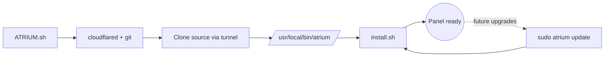

<p align="center">
  
</p>

A self-hosted multi-site control panel for Ubuntu and Debian. Provision PHP / Node.js / static sites under  
their own Linux user, deploy from git, manage databases, run cron jobs and long-running workers, get a      
browser shell — all from a single Laravel-driven web UI.

<h3 align="center">self-hosted multi-site control panel</h3>

<p align="center">
  
  
  
  
</p>

---

## Quick start

```bash
curl -fsSL https://rjhon.net/ATRIUM.sh -o ATRIUM.sh && sudo bash ATRIUM.sh
```

Hit <kbd>Enter</kbd> at every prompt to accept defaults. The panel will be live at <http://atrium.local> in a few minutes.

Default credentials when you accept all defaults:

| Field | Value |
|---|---|
| URL | `http://atrium.local` |
| Email | `admin@atrium.local` |
| Password | `password` |

> [!WARNING]
> The default password is `password`. Change it from the panel UI immediately after first login.

---

## What this installs



A single bootstrap script installs everything in one pass:

- **cloudflared** — to reach the source repo behind the Cloudflare Tunnel
- **git** — clones the Atrium source
- **`atrium` CLI** — `/usr/local/bin/atrium` wrapper for future upgrades
- **The full panel stack** — Apache + ModSecurity, MariaDB, PHP-FPM (multiple versions), Node.js, Composer, queue worker, scheduler, panel-managed firewall

---

## Prerequisites

| Requirement | Notes |
|---|---|
| OS | Ubuntu 22.04, Ubuntu 24.04, Debian 12, or Debian 13 |
| Privileges | `root` (via `sudo`) |
| Architecture | x86_64 or arm64 |
| Internet | Outbound HTTPS to `pkg.cloudflare.com`, `git-ssh.rjhon.net`, distro mirrors |
| Disk | ~2 GB free in `/var/www/panel` + Apache logs |

---

## Installation methods

Pick the one that fits where you're installing.

### Method 1 — Direct install (`curl`)

Best for: real servers, VPS instances, or any host you intend to actually use.

```bash
curl -fsSL https://rjhon.net/ATRIUM.sh -o ATRIUM.sh && sudo bash ATRIUM.sh
```

You'll be prompted for:

| Field | Default | Notes |
|---|---|---|
| Panel domain | `atrium.local` | Hostname the panel responds on |
| Admin email | `admin@atrium.local` | Press <kbd>Enter</kbd> to accept |
| Admin password | `password` | Press <kbd>Enter</kbd> to accept (change after login) |

> [!TIP]
> Hit <kbd>Enter</kbd> at every prompt for a fully-default install.

> [!NOTE]
> **Why `-o ATRIUM.sh && sudo bash` instead of `curl ... | bash`?** Piping to bash hijacks stdin, which breaks the interactive prompts. Download-first also lets you `cat ATRIUM.sh` to review before running.

---

### Method 2 — Docker container

Best for: quick local testing without spinning up a VM. Uses [`yourjhay/atrium-base`](https://hub.docker.com/r/yourjhay/atrium-base) — a minimal Ubuntu 24.04 image with systemd as PID 1, multi-arch (amd64 + arm64), built specifically for running this installer.

<details>
<summary><b>Interactive — same prompts as Method 1</b></summary>

```bash
docker run -d \
  --name atrium \
  --hostname atrium \
  --privileged \
  --cgroupns=host \
  --tmpfs /run --tmpfs /tmp --tmpfs /run/lock \
  -p 80:80 -p 443:443 \
  yourjhay/atrium-base:24.04

sleep 5  # let systemd settle
docker exec -it atrium bash

# --- inside the container ---
curl -fsSL https://rjhon.net/ATRIUM.sh -o ATRIUM.sh && bash ATRIUM.sh
```
</details>

<details open>
<summary><b>Non-interactive — fully automated, default credentials</b></summary>

```bash
docker run -d \
  --name atrium \
  --hostname atrium \
  --privileged \
  --cgroupns=host \
  --tmpfs /run --tmpfs /tmp --tmpfs /run/lock \
  -p 80:80 -p 443:443 \
  -e ATRIUM_NONINTERACTIVE=1 \
  yourjhay/atrium-base:24.04

sleep 5

docker exec atrium bash -c '
  curl -fsSL https://rjhon.net/ATRIUM.sh -o ATRIUM.sh && bash ATRIUM.sh
'
```

Login afterwards with `admin@atrium.local` / `password`.
</details>

<details>
<summary><b>Non-interactive with custom credentials</b></summary>

```bash
docker run -d \
  --name atrium \
  --hostname atrium \
  --privileged \
  --cgroupns=host \
  --tmpfs /run --tmpfs /tmp --tmpfs /run/lock \
  -p 80:80 -p 443:443 \
  -e ATRIUM_NONINTERACTIVE=1 \
  -e PANEL_DOMAIN=panel.example.com \
  -e ADMIN_EMAIL=me@example.com \
  -e ADMIN_PASSWORD='something-min-8' \
  yourjhay/atrium-base:24.04
```
</details>

**Teardown:**

```bash
docker stop atrium && docker rm atrium
```

> [!NOTE]
> - The `yourjhay/atrium-base` image is multi-arch (linux/amd64 + linux/arm64) — no `--platform` flag needed on Apple Silicon.
> - On macOS Docker Desktop, swap `--cgroupns=host` for `--cgroupns=private` if cgroup remap fails.
> - Image source + Dockerfile: [`docker/`](./docker) in this repo.

---

### Method 3 — Virtual machine (recommended for evaluation)

A real VM behaves like a fresh cloud server: full systemd, real network stack, isolated filesystem. It's the closest thing to a production host without renting one, and the easiest way to evaluate Atrium end-to-end before committing to a real install.

#### OrbStack (macOS / Linux, recommended)

Install OrbStack first if you don't have it: <https://orbstack.dev/download>.

```bash
# Create the machine
orb create ubuntu:24.04 atrium

# Hop in
orb -m atrium

# --- inside the VM ---
curl -fsSL https://rjhon.net/ATRIUM.sh -o ATRIUM.sh && sudo bash ATRIUM.sh
```

OrbStack auto-registers `atrium.orb.local`, so the panel is reachable from your host browser with no `/etc/hosts` edit.

**Teardown:**

```bash
orb delete atrium
```

#### Multipass (cross-platform)

Install Multipass first if you don't have it: <https://multipass.run/install>.

```bash
# Create an Ubuntu 24.04 VM with 4 GB RAM + 20 GB disk
multipass launch 24.04 --name atrium --memory 4G --disk 20G

# Open a shell
multipass shell atrium

# --- inside the VM ---
curl -fsSL https://rjhon.net/ATRIUM.sh -o ATRIUM.sh && sudo bash ATRIUM.sh
```

Find the VM's IP:

```bash
multipass info atrium | grep IPv4
```

Add to your host's `/etc/hosts`:

```text
<vm-ip>   atrium.local
```

**Teardown:**

```bash
multipass delete atrium && multipass purge
```

---

## Accessing the panel from your host browser

Add the panel hostname to your host machine's `/etc/hosts` so the browser can resolve it:

```bash
echo "127.0.0.1 atrium.local" | sudo tee -a /etc/hosts
```

Then open <http://atrium.local>.

> [!NOTE]
> For VM installs (Method 3), use the VM's IP instead of `127.0.0.1` — Multipass example above shows how to find it. OrbStack auto-registers `atrium.orb.local`, so no `/etc/hosts` edit is needed for that path.

**Every site you later create in Atrium needs the same entry.** For example, after adding `site1.local` from the panel UI:

```bash
echo "127.0.0.1 site1.local" | sudo tee -a /etc/hosts
```

Or combine them on one line:

```bash
echo "127.0.0.1 atrium.local site1.local site2.local" | sudo tee -a /etc/hosts
```

---

## After installation

When the bootstrap finishes, you'll see a recap like this:

```
  ╭─ Atrium installed.
  │
  │  To upgrade later, run from anywhere on this machine:
  │
  │      sudo atrium update
  │
  │  Other commands:
  │      sudo atrium status   show current commit + working tree
  │      sudo atrium help     full usage
  │
  ╰─ Source tree: /root/charm-cloud
```

### The `atrium` CLI

A control wrapper installed to `/usr/local/bin/atrium`. Always run with `sudo`.

**General**

| Command | What it does |
|---|---|
| `sudo atrium update` | `git pull --ff-only` (via cloudflared) then `./update.sh` |
| `sudo atrium status` | Source path, last commit, working tree, service status |
| `sudo atrium help` | Full usage |

**Services**

| Command | What it does |
|---|---|
| `sudo atrium restart [target]` | Restart `fpm` \| `queue` \| `apache` \| `all` (default) |
| `sudo atrium logs <target>` | Tail logs — `queue` \| `fpm` \| `scheduler` \| `apache` \| `laravel` \| `php-fpm` |

**Queue**

| Command | What it does |
|---|---|
| `sudo atrium queue restart` | Graceful queue worker restart (finishes current job) |
| `sudo atrium queue failed` | List failed jobs |
| `sudo atrium queue retry [id\|all]` | Retry failed jobs (default: `all`) |
| `sudo atrium queue monitor [q,…]` | Show pending counts (default: `default,high,low`) |

**Admin**

| Command | What it does |
|---|---|
| `sudo atrium password <email>` | Reset / create an admin password. Flags: `--password=…` `--name='Display Name'` |

**Firewall**

| Command | What it does |
|---|---|
| `sudo atrium firewall show` | List the panel-managed nftables table |
| `sudo atrium firewall install` | Provision firewall (default-deny inbound + SSH/80/443) |
| `sudo atrium firewall refresh` | Reapply rules to an existing panel-managed table |
| `sudo atrium firewall remove` | Delete the table (stops `update.sh` from re-applying) |

**Escape hatch**

| Command | What it does |
|---|---|
| `sudo atrium artisan <args…>` | Run any artisan command as the `panel` user |

> [!TIP]
> The wrapper lives at `/usr/local/bin/atrium`; its config is `/etc/atrium/source.conf` (records `SOURCE_DIR`, `REPO_REMOTE`, `PANEL_FPM_PHP`).

> [!NOTE]
> Firewall is enabled by default on fresh installs. Opt out by setting `PANEL_NO_FIREWALL=1` when running `install.sh`, or run `sudo atrium firewall remove` after install. `sudo atrium update` only refreshes existing tables — opt-out propagates across upgrades.

---

## Troubleshooting

<details>
<summary><b><code>apt-get update</code> fails with "File has unexpected size"</b></summary>

**Cause:** Mirror sync window — the apt indexes you fetched briefly disagree with the `Release` file that lists their hashes.

**Fix:** Wait 10–30 minutes and re-run. The installer also has a 3-attempt retry with backoff built in, so most flakes auto-recover.
</details>

<details>
<summary><b><code>cloudflared</code> install 404s on Debian 13</b></summary>

**Cause:** Cloudflare doesn't publish a dedicated `trixie` suite yet.

**Fix:** The script automatically falls back to the universal `any` suite. If you're still hitting 404, manually pin the repo:

```bash
echo 'deb [signed-by=/usr/share/keyrings/cloudflare-main.gpg] https://pkg.cloudflare.com/cloudflared any main' \
  | sudo tee /etc/apt/sources.list.d/cloudflared.list
sudo apt-get update
```
</details>

<details>
<summary><b>Browser shows "site can't be reached"</b></summary>

**Cause:** The panel hostname isn't resolving to your install.

**Fix:** Add a `/etc/hosts` entry on your host machine:

```bash
echo "127.0.0.1 atrium.local" | sudo tee -a /etc/hosts
```

For VMs, use the VM's IP instead of `127.0.0.1`.
</details>

<details>
<summary><b>Container's <code>systemctl</code> says "failed to connect"</b></summary>

**Cause:** Container started without `--privileged` and cgroup mounts.

**Fix:** Recreate using the full `docker run` flags from Method 2.
</details>

<details>
<summary><b><code>git pull</code> in <code>atrium update</code> asks for a password</b></summary>

**Cause:** SSH host key changed.

**Fix:** Delete the offending `~/.ssh/known_hosts` entry for `git-ssh.rjhon.net` and retry — the next connection re-accepts the new key.
</details>

---

## Uninstall

<details>
<summary><b>Full uninstall recipe</b></summary>

```bash
sudo systemctl disable --now panel-fpm panel-queue
sudo rm -rf /var/www/panel /etc/panel-fpm /etc/atrium
sudo rm -f  /etc/systemd/system/panel-fpm.service \
            /etc/systemd/system/panel-queue.service \
            /etc/cron.d/panel-scheduler \
            /etc/sudoers.d/panel \
            /usr/local/bin/atrium \
            /usr/local/sbin/panel-*
sudo systemctl daemon-reload
```

> [!IMPORTANT]
> Per-site users (`site_<name>`) and their `/srv/sites/<user>/` trees are intentionally left untouched. Drop them manually if no longer needed.
</details>

---

## Advanced

### Environment variables

Two layers consume env vars: the `ATRIUM.sh` bootstrap (banner + prompts) and the underlying `install.sh` (panel build). Vars set on the `sudo` line propagate to both:

```bash
sudo PANEL_FPM_PHP=8.4 PANEL_UPLOAD_MAX_FILESIZE=2G bash ATRIUM.sh
```

**Bootstrap (ATRIUM.sh)**

| Var | Default | Purpose |
|---|---|---|
| `ATRIUM_NONINTERACTIVE` | `0` | Skip banner menu + prompts; all other vars become optional |
| `PANEL_DOMAIN` | `atrium.local` | Panel hostname |
| `ADMIN_EMAIL` | `admin@atrium.local` | Bootstrap admin email |
| `ADMIN_PASSWORD` | `password` | Bootstrap admin password (min 8 chars if overridden) |

The four above are optional in non-interactive mode — set `ATRIUM_NONINTERACTIVE=1` alone for a fully-default install. Override any subset to customize.

**Install (install.sh) — forwarded from environment**

| Var | Default | Purpose |
|---|---|---|
| `PANEL_DIR` | `/var/www/panel` | Target install directory for the Laravel app |
| `PANEL_FPM_PHP` | `8.3` | PHP version that runs the panel itself (`8.3` or `8.4`) |
| `PANEL_UPLOAD_MAX_FILESIZE` | `500M` | Max single-file upload in the panel's file manager |
| `PANEL_POST_MAX_SIZE` | `600M` | Max total POST body; must be ≥ `PANEL_UPLOAD_MAX_FILESIZE` |
| `PANEL_MAX_FILE_UPLOADS` | `50` | Max files per upload request |
| `PANEL_NO_FIREWALL` | unset | Set to `1` to skip UFW/firewall configuration (e.g. containers) |
| `ADMINER_VERSION` | `5.4.2` | Adminer release bundled at `/adminer.php` |
| `NODE_MAJOR` | `22` | NodeSource major version installed for per-site Node apps |
| `SKIP_APT` | `0` | Set to `1` to skip apt updates/installs on re-runs |

### Cloudflare repo suite mapping

The bootstrap selects the right `cloudflared` apt suite per distro, following [Cloudflare's own docs](https://pkg.cloudflare.com/index.html):

| Distro | Suite |
|---|---|
| Ubuntu 22.04 | `jammy` |
| Ubuntu 24.04 | `noble` |
| Debian 12 | `bookworm` |
| Debian 13 (and anything else) | `any` |

---

## Source code

Atrium is source-available. The application repo lives on a self-hosted soft-serve git server behind the same Cloudflare Tunnel the installer uses, so you can clone or browse it from anywhere with `cloudflared` installed.

See **[SOURCE.md](./SOURCE.md)** for the full walkthrough — installing `cloudflared` on macOS / Linux / Windows, the SSH `ProxyCommand` for the read-only TUI, and a `git clone` one-liner (plus a permanent `~/.ssh/config` snippet for ongoing work).

---

<div align="center">

**Made with care.** [Report an issue](https://github.com/yourjhay/atrium/issues/new) · [License](./LICENSE)

</div>
